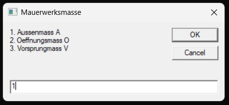

# Mauerwerksmaße

Dies ist ein simples VB Script, dass Mauerwerksmaße für Außenmaße, Öffnungsmaße und Vorsprungsmaße berechnet.

## Verwendete Formeln

### Außenmaß

Das Außenmass wird in diesem Sript wie folgt berechnet:

$A = Anzahl_{Achtelmaß} \cdot 12.5  - 1$

### Öffnungsmaß

Das Öffnungsmaß wird nach folgender Formel berechnet:

$Ö = Anzahl_{Achtelmaß} \cdot 12.5 + 1$

### Vorsprungsmaß

Das Vorsprungsmaß wird in diesem wie folgt berechnet:

$V = Anzahl_{Achtelmaß} \cdot 12.5$

### Anmerkung zum Ergebniss

Die Ergebnisse dieser Formeln sind in cm. Im vorliegenden Script werden jedoch Maße größer 100 cm auf m, und Maße größer 100\*1000 cm auf km ungerechnet.

## Eingabe

*Abbildung 1: Auswahl von des Maßes*

*Abbildung 2: Eingabe Vielfaches des Achtelmaßes*

*Abbildung 3: Ausgebe des Ergebnisses*

